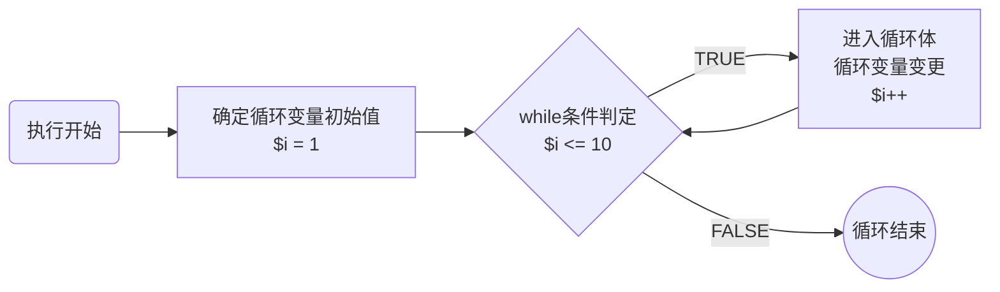
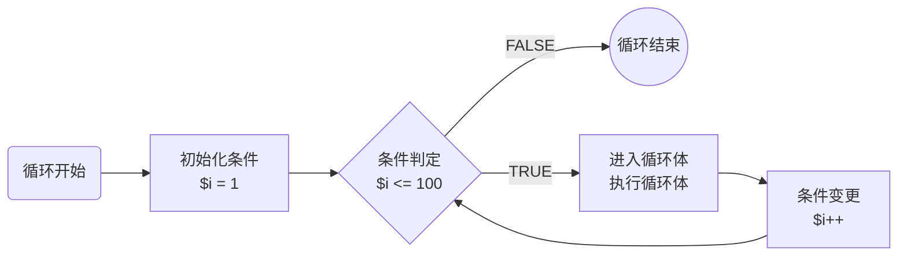
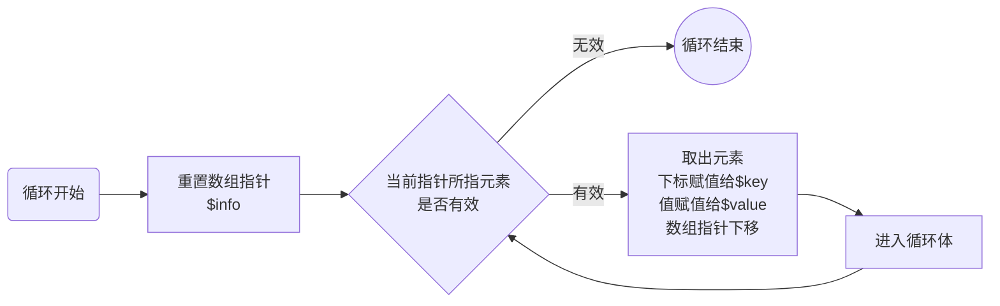
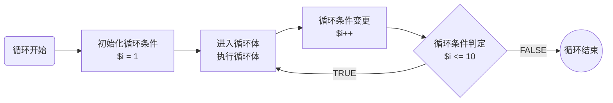
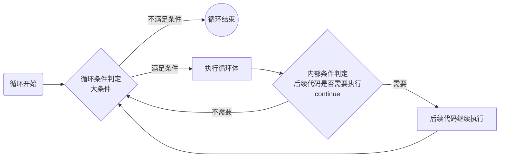
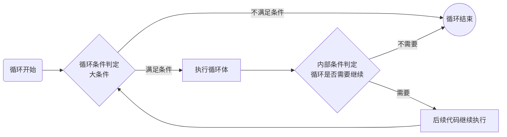
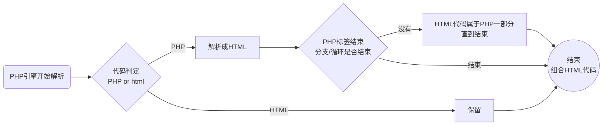

# 一、流程控制


> 举个栗子


晨练


说明：我们每天都在做一些类似的事情

1、顺序执行某些事情：起床后刷牙

2、在规划后选择某一件执行：两个晨练方案，根据天气条件选择执行

3、在做某一件事情之后重复执行：跑圈圈


> 概念

**流程控制**：就是设定好代码的执行流程，流程控制有三大结构

* 顺序结构：代码逐行向下顺序执行
* 分支结构：设定好代码，根据条件选择性执行
* 循环结构：设定好代码，根据条件重复执行


> 小结

1、流程控制是代码为了实现现实的业务场景而设计的代码运行方式

2、流程控制分为三种

* 顺序结构：代码顺序执行
* 分支结构：代码选择性执行
* 循环结构：代码重复执行


## 1、顺序结构


> 目标：了解代码的顺序执行方式


> 概念

**顺序结构**：即代码是以行为单位，逐行向下执行的


> 示例

```PHP
$a = 10;

echo $a;
```

以上执行逻辑

1、执行第一行：$a = 10，在内存产生变量

2、执行第二行：echo $a，输出10（空行忽略）

3、执行到最后：脚本执行结束，销毁所有资源


> 小结

1、代码默认是顺序结构执行，即逐行向下


## 2、分支结构


> 目标：掌握分支结构的基本逻辑，掌握分支结构的实际运用


> 概念

**分支结构**：即在编写代码的时候，考虑到各种情形，将不同情形的代码实现分块。在实际运行的时候根据条件选择相应的代码块执行（一般只执行一块代码）

* IF分支：典型的互斥分支，根据条件选择一块代码执行
* Switch分支：粒子分支，条件的颗粒度较强，可以选择一块或者多块执行
* 分支结构是编程中非常常见的一种代码结构


> 步骤

1、确定条件（通常可变）

2、设置不同条件的代码

3、根据条件执行代码


> 小结

1、分支结构是要提前准备条件和多个代码块（有可能只有一个代码块）

2、分支执行是根据条件选择代码块执行

* IF分支（互斥）：最多执行一个代码块
* switch分支：根据开发人员控制可以选择一个或者多个代码块执行


### 2.1、IF分支


> 目标：掌握IF分支的结构语法，以及能够运用IF结构实现分支结构解决问题


> 概念

IF分支：一种可以接收任意条件的分支结构

* 简单IF分支：条件满足执行，不满足不执行代码
  * if(条件表达式){满足条件后执行的代码块}
* 标准IF分支：条件满足执行一块代码，不满足执行另外一块代码
  * if(条件表达式){满足条件后执行的代码块}else{不满足条件执行的代码块}
* 复杂IF分支：有多个条件，条件有递进性
  * if(条件1){满足执行}elseif(条件2){不满足条件1满足条件2执行}...else{都不满足执行}
* IF分支永远最多执行一个代码块
* IF分支代码块里可以嵌入IF分支


> 步骤

1、确定条件

* 条件是否唯一

2、确定分支代码块

* 满足条件的代码块
* 不满足条件的代码块（非必须：看功能需要）

3、根据条件执行


> 示例

1、明天天气好，我就出去走走

```PHP
#确定条件
$weather = 'good';

#确定分支代码块
if($weather == 'good'){
    echo '出去走走';
}
#结果：出去走走

#执行时：如果$weather == 'good'，执行代码块；否则跳过
```


2、明天天气好，我就出去走走；否则我就在家睡觉

```PHP
#确定条件
$weather = 'bad';

#确定分支代码块
if($weather == 'good'){
    echo '出去走走';
}else{
    echo '在家睡觉';
}
#结果：在家睡觉

#执行时：如果$weather == 'good'，执行代码块'出去走走'；其他所有条件都执行'在家睡觉'
```


3、明天天气出太阳，出去走走；天气刮风，去看电影；天气阴天，在家看书；否则睡觉

```php
#确定条件
$weather = 'rain';

#确定分支代码块
if($weather == 'sun'){
    echo '出去走走';
}elseif($weather == 'wind'){
    echo '去看电影';
}else if($weather == 'cloud'){	#PHP中elseif和else if效果一样
    echo '在家看书';
}else{
    echo '睡觉';
}
#结果：睡觉

/*
 执行步骤
 1、判定$weather == sun是否匹配：不匹配
 2、判定$weather == wind是否匹配：不匹配
 3、判定$weather == cloud是否匹配：不匹配
 4、有else，前面都不匹配，自然落到else中：睡觉
*/
```


4、明天天气好：出太阳，出去走走；其他，去看电影；天气不好：阴天，看电视；其他，睡觉

```php
#确定条件：两组条件（大条件和小条件）
$weather1 = 'good';
$weather2 = 'sun';

#确定分支代码块：大条件
if($weather1 == 'good'){
    #天气好：确定小条件
    if($weather2 == 'sun'){
        echo '出去走走'
    }else{
        echo '去看电影';
    }
}else{
    #天气不好：确定小条件
    if($weather2 == 'cloud'){
        echo '看电视';
    }else{
        echo '睡觉';
    }
}
```


> 小结

1、IF分支是一种可以有多个条件，但是最多只会执行一个代码块的分支

2、IF在实际开发中根据条件的细分，可以有多种结构

* 简单IF分支：只有一个if条件和满足条件的代码块
* 基本IF分支：只有一个if条件和满足条件的代码块，同时还有else不满足条件的代码块
* 复杂IF分支：有if条件和满足的代码块，也有不满足前面条件，但是可以还可以满足其他条件的代码块，而且理论不限

3、IF分支可以解决所有根据条件所有可能的情形

4、IF中可以嵌入IF分支，建议不要超过3层，太多层会让代码的可读性变差


### 2.2、Switch分支


> 目标：掌握switch分支的结构语法，以及能够运用Switch结构实现分支结构解决问题


> 概念

**Switch分支**：一种接收颗粒条件的分支结构

* Switch分支：条件是具体值，而不是范围条件
* Switch代码块是写在一起的，使用case分开，而不是{}
* Switch代码块允许执行多个（如果有必要）
* Switch结构

```php
switch(条件变量){
	case 值:
		满足条件1要执行的代码块
		代码执行控制：break
	...
	default :
		不满足所有条件执行的代码块
        代码执行控制：break
}
```


> 步骤

1、确定目标条件：条件必须是颗粒度的，通常是一个变量（没有比较符号）

2、确定可能出现的结果：一个条件对应一个case指令

3、确定每个case指令下要执行的代码

4、确定每个case指令是否需要结束

* 结束使用break
* 不结束，代码会继续执行下一个case的代码块（代码块共享）

5、确定是否需要不满足条件的代码块：default

* 没有：结束
* 有：确定default的代码块


> 示例

1、明天天气出太阳，出去走走；天气刮风，去看电影；天气阴天，在家看书；否则睡觉

```php
#假设外部接收条件：条件变量为$weather，值为sun、wind、cloud和其他
switch($weather){
        #匹配第一个值：直接取$weather的值即可
    case 'sun':
        echo '出去走走';
        break;			#结束：表示switch完结
    case 'wind':
        echo '去看电影';
        break;
    case 'cloud':
        echo '在家看书';
        break;
    default:			#其他值
        echo '睡觉';
        break;			#最后一个可以没有break
}

/*
 执行逻辑
 1、switch根据条件进入
 2、匹配$weather的值：找到合适的case
  2.1：找到：执行
  	2.1.1：有break：结束
  	2.1.2：没有break：继续执行后面的case指令
  2.2：没有找到，进入default
*/
```


2、一周7天，1-5天上班，6和7休息（共享代码块）

```PHP
#确定条件：条件是1-7，每次都是一个具体的值（颗粒度）
$day = 2;

#判定条件
switch($day){
    #确定条件及其要执行的代码块
    case 1:		#$day的值为1，等价于 $day == 1
        echo '上班';
        #确定是否要结束 
        
        break;
    case 2:		#发现2-5其实是同一件事情，所以可以省去重复执行的代码块
    case 3:
    case 4:
    case 5:
        echo '上班';
        break;
    case 6:
    case 7:
        echo '休息';
        break;
    #确定是否需要不满足条件结果
    default:
        echo '没有这样的日子';
        break;
}

/*
 执行逻辑
 1、switch根据条件进入
 2、匹配是否有合适的case，没有进入default，有进入：2进入case 2
 3、进入case 2后开始执行代码块：没有
 4、看看case 2后没有发现结束语句：break，继续向下执行，进入case 3
 5、同理直到进入case 5：执行代码块，发现break，结束switch
*/
```


> 小结

1、switch是一种用来实现颗粒条件的分支结构

* 只适合固定值：case 具体值（内部使用 == 比较）
* 不适合进行大小比较：不能case 条件 > 10之类

2、switch的结构如下

```php
switch(条件变量){
    case 值1：
        代码块;
        break;
    case 值2:
        代码块;
        break;
    default:
        代码块;
        break;
}
```

3、break如果不写，那么可以实现多个case共享一个代码块

4、default可以没有

5、凡是switch能做的分支，if都能做；但是if能做的switch不一定能做


## 3、循环结构


> 目标：掌握循环的结构语法，掌握循环的实际运用


> 概念

**循环结构**：指通过某种条件的限定，然后某个代码块进行可控的重复的执行

* 循环结构一般包含以下几个部分
  * 循环条件：判定循环是否执行
  * 循环变量变化：让条件持续改变
  * 循环体：要重复执行的代码块
  * 循环控制：内部对循环的控制
* PHP中循环结构有以下几个
  * while循环：不确定条件的重复执行
  * for循环：一般指定次数的重复执行
  * foreach循环：专门遍历数组
  * do-while循环：了解
* 循环控制：内部控制循环的执行


> 步骤

1、根据循环条件确定要重复的内容，选择合适的循环结构

2、确定循环条件的边界

3、确定循环条件的变更方式

4、确定循环体（要重复执行的代码块）

5、确定循环内部控制（不一定要）


> 小结

1、循环结构是一种让代码在可控范围内执行N次的流程结构（重复执行）

2、循环结构包含多种

* while循环
* for循环
* foreach循环
* do-while循环

3、循环也可以在内部进行循环控制


### 3.1、while循环


> 目标：掌握while循环的基本语法，熟练运用while循环实现内容重复执行


提问：想输出1-10可不可以不是10次echo呢？

回答：可以，1到10是有规矩，找一个东西从1变到10就好


> 概念

**while循环**：在指定边界条件下，持续执行代码的一种循环

* while循环需要边界条件（也可以没有）
* while条件需要在内部控制循环变量
* while循环多用来实现一些条件不大明确的循环
* 语法结构

```php
while(条件表达式){
    循环体;
    循环条件变更;
}
```


> 步骤

1、通常会在循环开始前定义一个循环变量的初始值

2、确定循环条件的边界条件

3、确认循环体（循环要干嘛）

4、变更循环条件


> 示例

```php
#输出1-10

#1、确定循环变量初始值：可以是1，也可以是10
$i = 1;

#2、确定循环边界条件：10
while($i <= 10){
    #3、确定循环体：输出1-10
    echo $i;				#$i代表1
    
    #4、变更循环条件
    $i++;
}
```


> 流程图解析

以上图输出1-10的整数为例




> 小结

1、while循环是一种利用外部循环条件实现代码重复执行的循环

2、while循环基本逻辑

* 定义循环条件初始值：1次执行
* 在while(条件表达式)中确定循环的边界条件：N + 1次执行
* 在循环内部实现循环体：N次执行
* 在循环内部实现循环变量的变更：N次执行


### 3.2、for循环


> 目标：掌握for循环的语法结构，熟练使用for循环实现代码重复执行


> 概念

**for循环**：一种将循环初始条件、循环边界条件和循环条件变更都可以放到循环结构里（不是循环体）的循环

* for循环需要循环初始化条件，但可以在循环结构里
* for循环需要边界条件，也可以放在循环结构里
* for循环进行循环条件变更，也可以放到结构里
* for循环一般用来实现一些固定起始、边界和步长（条件变化的规律）的循环，多与数字有关
* for语法结构

```php
for(初始化条件表达式;边界判定表达式;条件变更表达式){
    循环体
}
```


> 步骤

1、确定循环初始化条件

2、确定边界条件

3、确定变化规则（步长）

4、确定循环体


> 示例

输出1-100之间的所有奇数

```php
#确定初始条件：1：$i = 1;
#确定边界条件：100：$i <= 100;
#确定条件变化规则：1-100的整数：$i++
#确定循环体：输出变化中的$i：奇数：$i % 2 == 1

for($i = 1;$i <= 100;$i++){
    #循环体：找到奇数
    if($i % 2 == 1){
        #说明是奇数
        echo $i;
    }
}
```


循环嵌套：打印九九乘法表

```php
#打印九九乘法表：一个循环要么打印一行1,2,3,4,5，要么打印一列（<br/>）
#而九九乘法表是一个表格，有行有列：所以单个循环肯定无法完成，需要多个循环共同完成

#分析
#1、确定一个循环：能够打印9行
for($i = 1;$i <= 9;$i++){
    #9行其实就是一个换行符代表换一行
    echo '<br/>';
}

#2、确定一个循环：能够输出9列
for($j = 1;$j <= 9;$j++){
    echo $j;
}

#3、以上两个是独立的循环，彼此没有交集：我们需要一行里就有9列，而不是只有一列：将能够输出9列的循环移入到能输出行的循环中
for($i = 1;$i <= 9;$i++){
    #将打印9列的循环移入到能打印行的循环中：实现9行9列输出
    for($j = 1;$j <= 9;$j++){
        echo $j;
    }
    #9行其实就是一个换行符代表换一行
    echo '<br/>';
}

#4、确定每一个单元的输出：九九乘法表并非一直输出，输出逻辑是：列数不大于行数，从第一列开始输出，第1个数为列号，第二个乘数为行号
/*
 1 * 1 = 1
 1 * 2 = 2    2 * 2 = 4	#第一个数1,2为列数，第二个数2位行数
*/
for($i = 1;$i <= 9;$i++){
    #将打印9列的循环移入到能打印行的循环中：实现9行9列输出
    for($j = 1;$j <= 9;$j++){
        #输出：确保列数不能大于行数
        if($j <= $i){
         	#有效输出位置：列号在前，行号在后
            echo "$j * $i = " . $j * $i . ' ';	#输出带一个空格
            #"$j * $i = "是一个字符串只会解析变量，$j * $i是一个乘法表达式，会得出结果
        }
    }
    #9行其实就是一个换行符代表换一行
    echo '<br/>';
}
```


> 流程图解析

以上图输出1-100之间的奇数为例




> 小结

1、for循环是可以所有循环参与条件都在for循环结构内部的循环

2、for循环结构如下

```php
for(表达式1;表达式2;表达式3){
   循环体   
}
```

3、for循环执行流程

* 表达式1：用来初始化条件（只执行一次）
  * 如果初始化条件在外部，该位置可以空出
  * 如果有多个条件需要初始化，该位置可以使用逗号分隔
* 表达式2：用来验证条件（起始到边界总次数+1次【最后一次失败循环退出】）
  * 验证通过：进入循环体
  * 验证失败：结束循环
* 循环体：执行重复内容（起始到边界总次数）
* 表达式3：变更循环条件（起始到边界总次数）

4、for循环实际通常用来做一些明确次数的循环


### 3.3、foreach循环


> 目标：掌握foreach的语法结构，了解foreach原理，灵活使用foreach进行数组遍历


> 概念

foreach循环：PHP中专门进行数组遍历的循环

* foreach循环专门遍历数组
* foreach循环可以解析数组的下标和值
* foreach语法

```php
foreach(数组变量 as [下标变量 =>] 值变量){
    通过下标变量读取数组中每个元素的下标（可以没有）
    通过值变量读取数组中每个元素的值
}
```


> 步骤

1、确定要遍历的数组

2、确定是否需要用到下标

3、确定下标变量和值变量（名字自取：\$k|\$key，\$v|$value）

4、确定循环体


> 示例

输出个人的全部信息

```php
#定义数组
$info = array('name' => '鸣人','skill' => '螺旋丸');

#1、确定要遍历的数组$info
#2、确定是否需要下标：需要
#3、确定相关变量：下标使用$key保存，值使用$value保存
foreach($info as $key => $value){
    #4、确定循环体：输出信息
    echo $key . ' : ' . $value . '<br/>';
}
```


> 流程图解析

以上述案例为例：数组有一个元素指针，默认指向第一个元素




> 小结

1、foreach是专门用来进行数组遍历的

2、foreach是根据数组指针所在的位置挨个取出元素的

* 重置指针：执行一次
* 判定指针有效性
  * 指针有效：取出数组元素
    * 下标赋值给下标变量（如果提供了下标变量）
    * 值赋值给值变量
    * 指针下移
  * 指针无效：循环结束
* 进入循环体

3、foreach可以不获取数组元素的下标

4、foreach极少对一维数组进行遍历，通常是二维数组（多维）


### 3.4、do-while循环


> 目标：了解do-while的基本语法以及执行原理，了解do-while与while的区别


> 概念

do-while循环：是一种先执行循环体（do）然后再考虑条件的循环

* do-while循环需要边界条件
* do-while循环在内部变更循环条件
* do-while用来处理不明确条件的循环
* do-while语法

```php
do{
    循环体
    循环条件变更
}while(循环条件判定);
```


> 步骤

1、通常会在循环开始前定义一个循环变量的初始值

2、确认循环体（循环要干嘛）

3、变更循环条件

4、确定循环条件的边界条件


> 示例

输出1-10

```PHP
#定义条件初始变量
$i = 1;

#循环开始
do{
    #输出
    echo $i;
    #循环条件变更
    $i++;
}while($i <= 10);		#注意：需要分号结尾
```


> 流程图解析




> 小结

1、do-while也是一种利用外部循环条件实现的内部代码重复执行的循环

2、do-while循环的语法

```php
循环条件初始化
do{
	循环体
    循环条件变更
}while(循环条件判定);
```

3、do-while与while循环的区别

* while是先判定条件后执行，do-while是先执行后判定条件
* do-while一定会保证循环体至少循环一次，而while未必会执行循环体

4、在PHP中do-while基本不使用（了解一下这个原理）


### 3.5、循环控制


> 目标：掌握循环控制的基本原理和实际需求，利用循环控制实现循环内部控制


提问：如果在循环执行过程中出现了某些异常或者某些不符合条件的，能怎么办？

回答：循环控制


> 概念

循环控制：即循环体内通过代码对控制循环如何执行

* 循环体内控制代码的执行方向
* 循环控制是为了增加程序的健壮性，让开发者可以在循环内部把握循环的正确执行
* 根据需求（条件）进行控制
  * 终止单次循环体执行：continue [层级]，层级默认1（直接进行下一次循环）
  * 终止循环（循环结束）：break [层级]，层级默认1


> 步骤

1、循环开始

2、循环体内是否需要判定条件

* 条件满足：选择控制
  * 确定控制层级（单层循环不需要）
* 条件不满足：不需要控制


> 示例

求出1-100之间所有非3的倍数的和

```php
#定义初始变量（使用while循环）
$i = 1;
$sum = 0;	#记录和

while($i <= 100){
    #确定当前变量$i是否是3的倍数
    if($i % 3 == 0){
        #是3的倍数：这个值不记录：但是后续的代码不用再执行（注意条件要变化）
        $i++;
        continue;		#continue之后的循环体不执行
    }
    
    #求和：同时变更变量
    $sum += $i++;		#等价于：$sum = $sum + $i++（后置自操作，先使用原值，后自操作）
}
```


求出1-100之间所有的数的和

```php
#定义初始变量
$i = 1;
$sum = 0;

#开始循环：条件永远为真
while(TRUE){
    #外部没有进行条件控制：说明循环是死循环，我们要在内部保证循环不会一直执行
    if($i > 100){
        #已经不满足需求：循环没有必要继续
        break;
    }
    
    #如果前面条件不满足：说明当前是满足循环要求的，继续执行
    $sum += $i++;
}
```


九九乘法表优化

```php
#原九九乘法表
for($i = 1;$i <= 9;$i++){
    #将打印9列的循环移入到能打印行的循环中：实现9行9列输出
    for($j = 1;$j <= 9;$j++){
        #输出：确保列数不能大于行数
        if($j <= $i){
         	#有效输出位置：列号在前，行号在后
            echo "$j * $i = " . $j * $i . ' ';	#输出带一个空格
            #"$j * $i = "是一个字符串只会解析变量，$j * $i是一个乘法表达式，会得出结果
        }
    }
    #9行其实就是一个换行符代表换一行
    echo '<br/>';
}

#问题：当内存循环$j > $i之后，虽然不会输出，但是内层for循环会一直执行直到$j > 9，这部分是无效执行：所以应当优化，即内存循环$j > $i之后已经没有执行的意义了（结束循环）
for($i = 1;$i <= 9;$i++){
    #将打印9列的循环移入到能打印行的循环中：实现9行9列输出
    for($j = 1;$j <= 9;$j++){
        #输出：确保列数不能大于行数
        if($j <= $i){
         	#有效输出位置：列号在前，行号在后
            echo "$j * $i = " . $j * $i . ' ';	#输出带一个空格
            #"$j * $i = "是一个字符串只会解析变量，$j * $i是一个乘法表达式，会得出结果
        }else{
            #循环控制：进入else说明$j > $i，已经失去意义了
            break;	#当前break是控制所属循环（j循环），所以终止也是当前j循环，进入到i循环执行<br>
        }
    }
    #9行其实就是一个换行符代表换一行
    echo '<br/>';
}
```


> 流程图示例

continue流程控制




break流程控制




> 小结

1、循环控制是在循环内部提供了一种可以控制循环的机制

* 内部控制，给开发者提供灵活性
* 内部控制，给开发者提供优化空间（省去不必要的循环）

2、循环控制分为两种

* 终止单次循环：continue
* 终止整个循环：break

3、循环控制有层级，如果在多层循环中需要控制到不同的层级，可以使用层级数

* continue [N]：回到N层循环继续下一次循环开始
* break [N]：跳出到N+1层循环，如果没有N+1层循环，循环结束
* N如果为1，那么可以省去


# 二、标签语法


> 目标：了解标签语法的结构，掌握标签语法的意义和实际使用


> 举个栗子

PHP嵌入在HTML中输出表格

```php+HTML
<html>
    <head>
        <title>PHP嵌入到HTML中</title>
    </head>
    <body>
        <!--动态输出表格数据：打印九九乘法表-->
        <table>
            <?php
            	#外层循环：控制行（一行一个tr标记控制）
                for($i = 1;$i <= 9; $i++){
					echo '<tr>';
                    #内存循环：控制列和输出（一列一个td标签控制）
                    for($j = 1;$j <= 9;$j++){
                        echo '<td>';
                        #判定
                        if($j <= $i){                            
                            echo "$i * $j = " . $i * $j;  
                        } 
                        echo '</td>';
                    }
                    
                    echo '</tr>';
                }
            ?>
        </table>
    </body>
</html>
```


以上代码存在一个不好的地方

1、一些原本是HTML的代码如<tr>标记和<td>标记，都是直接写入到PHP，不利于前端维护

* 不方便样式控制
* 不方便属性控制


解决方案：让PHP只管数据，不管HTML标记

```php+HTML
<html>
    <head>
        <title>PHP嵌入到HTML中</title>
    </head>
    <body>
        <!--动态输出表格数据：打印九九乘法表：凡是HTML标记，都不受PHP控制-->
        <table>
            <?php
            	#外层循环：控制行（一行一个tr标记控制）
                for($i = 1;$i <= 9; $i++){      
            ?>
            <!--HTML标记不再属于PHP内部控制的代码-->
            <tr>
               <?php
                  #内存循环：控制列和输出（一列一个td标签控制）
                  for($j = 1;$j <= 9;$j++){
                ?>
                <!--HTML标记不再属于PHP内部控制的代码-->
                <td>
                <?php
                    if($j <= $i){
                        echo "$i * $j = " . $i * $j;
                    }     
                ?>
                <!--HTML标记不再属于PHP内部控制的代码-->
                </td>
                <?php }?>
            <!--HTML标记不再属于PHP内部控制的代码-->        
            </tr>
            <?php }?>
        </table>
    </body>
</html>
```


提问：以上代码中出现了很多的开始和结束标记，如循环和分支的，这样下来整个代码的阅读性变得很差，有没有办法解决呢？

回答：标签语法


> 概念

**标签语法**：指当PHP嵌入到HTML中时，为了让PHP代码的结构更加符合HTML的规范而设定的语法结构

* PHP标签语法不是所有的结构都存在
* PHP标签语法只提供了两种针对{}的解决方案
  * 分支标签：即当分支语法出现时，可以使用标签语法代替
  * 循环标签：即当循环语法出现时，可以使用标签语法代替
* 标签语法规则
  * 当分支或循环的 `{` 出现时，使用冒号 `:` 代替
  * 当分支或循环的 `}` 出现时，使用相应的 `end + 标记内容;` 代替
* PHP提供的标记语法
  * IF分支
  * switch分支
  * while循环
  * for循环
  * foreach循环
  * 语法格式
    * 起始标记（if为例）： `if(条件表达式):`
    * 结束标记（if为例）： `endif;`


> 步骤

1、正常将PHP嵌入到HTML代码中：HTML标记独立在PHP代码之外

2、如果碰到分支或者循环，考虑内部代码是否涉及HTML标记

* 不涉及：直接写完
* 涉及：那么使用标签语法


> 示例

将上述案例换成PHP标记语法

```php+HTML
<html>
    <head>
        <title>PHP嵌入到HTML中</title>
    </head>
    <body>
        <!--动态输出表格数据：打印九九乘法表：凡是HTML标记，都不受PHP控制-->
        <table>
            <?php
            	#外层循环：控制行（一行一个tr标记控制）
                for($i = 1;$i <= 9; $i++):     
            ?>
            <!--HTML标记不再属于PHP内部控制的代码-->
            <tr>
               <?php
                  #内存循环：控制列和输出（一列一个td标签控制）
                  for($j = 1;$j <= 9;$j++):
                ?>
                <!--HTML标记不再属于PHP内部控制的代码-->
                <td>
                <?php
                    #此处没有HTML标签介入，所以不用拆分
                    if($j <= $i){
                        echo "$i * $j = " . $i * $j;
                    }     
                ?>
                <!--HTML标记不再属于PHP内部控制的代码-->
                </td>
                <!--内存的for循环结束-->
                <?php endfor;?>
            <!--HTML标记不再属于PHP内部控制的代码-->        
            </tr>
            <!--外层的for循环结束-->
            <?php endfor;?>
        </table>
    </body>
</html>
```


> 流程图示例

流程图分析上述拆分PHP代码的解析逻辑




> 小结

1、标签语法是PHP基本语法的一种替代方式

2、PHP标签语法适用于分支和循环标记

3、PHP标签语法的格式就是代替分支和循环的{}，其中

* `{` 替代为 `:`
* `}` 替代为 `end + 标记内容;` 

4、PHP标签语法一般是为了方便前后端分离（PHP嵌入到HTML中）

* 分离PHP和HTML标记：方便前端设计HTML标记属性和样式效果
* 方便后台编程控制：当有多层` {` 和 `}` 时，容易进行标记匹配

5、扩展：PHP标签语法也可以在PHP代码里使用，但是不建议

```php
<?php
    #PHP标签语法
    if(10 < 100):
		echo '10';
	endif;
```

