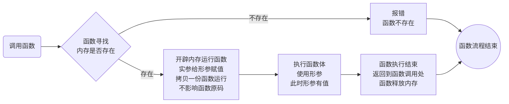
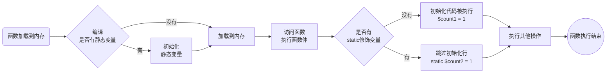
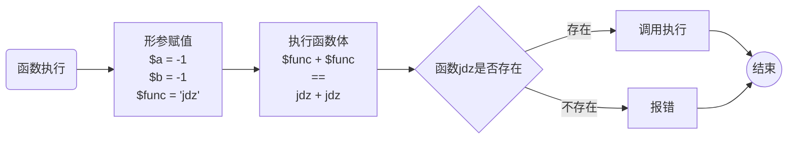

# 一、函数基本应用


> 目标：掌握函数的概念和作用，掌握模块化编程思想，理解函数的各个部分，能够自定义函数解决问题

* 函数的概念和应用
* 函数的基本结构
* 函数的定义规范


## 1、认识函数


> 目标：掌握函数的概念和作用


提问：如果有一个需求，会在不同的应用场景里都出现，那么怎么可以让代码可以多处使用呢？

回答：

1、复制粘贴：灵活性差，维护起来要多处维护

2、使用函数：一处维护，多处使用


> 举个栗子


1、买的东西可能变化

2、价格可能不同

3、买的时机不固定

4、但是买的过程每次都差一样

**所以**：以上完成买东西的过程，可以在需要用到的时候调取执行即可完成。


> 概念

**函数**：某段在一起解决某个问题的代码块，给代码块一个标识符，以后可以使用标识符来访问代码块

* 函数是由一堆代码块组成
* 函数会有一个函数标识（函数名）
* 函数能够在需要用到的时候通过名字直接让代码块运行
* 函数的作用
  * 模块化编程：业务拆分成小模块，然后使用函数进行代码编写
  * 代码的复用：通过调用函数实现函数代码块的重复利用
* 函数的基本结构
  * 关键字：function
  * 函数名：自定义的名字（代码块标志）
  * 参数：数据的改变（业务相同，数据可以不同）
  * 函数体：解决问题的代码块
  * return：返回值，函数运行的结果处理

```php
function 函数名(参数)
{
    函数体（代码块）
    return 返回值
}
```


> 示例

```php
# 买火腿
function getGoods(){
    #计算位置
    #计算距离
    #计算价格
    #计算时间
    return '火腿';
}

#写好上述代码后，凡是要买火腿的时候，都使用getGoods就可以了
```


> 小结

1、函数是一起解决某个问题的代码块，解决的问题是两个

* 模块化编程：一个函数就是一个模块的最小单元
* 代码的复用：函数代码可以在需要时重复利用

2、函数组成

* 关键字：function
* 函数名：函数使用的标志
* 参数：数据的动态改变，如果业务固定，那么可以没有参数
* 函数体：解决问题的代码块
* 返回值：函数处理完的结果处理，如果业务不需要返回值，可以没有


## 2、函数基本应用


> 目标：了解函数的定义规范和使用


> 概念

**函数应用**：是指根据需求定义函数，然后在需要的位置调用函数

* 定义函数
* 调用函数：使用函数名 + ()即可实现调用


> 步骤

1、分析需求功能

2、确定函数名

3、确定函数体

4、调用函数


> 示例

```php
#打印九九乘法表
#1、分析需求：打印九九乘法表，可能有多个位置需要使用（因此使用函数开发）

#2、确定函数名：九九乘法表，确定相关性
function chengfa99(){
    #3、确定函数体：输出（不需要返回值）
    for($i = 1;$i <= 9;$i++){
        for($j = 1;$j <= $i;$j++){
            echo "$j * $i = " . $j * $i  . ' ';
        }
        #换行
        echo '<br/>';
    }
}

#4、调用函数
chengfa99();
chengfa99();		#多次调用，不需要重复写99乘法表逻辑
```


> 小结

1、函数应用分为两个部分

* 定义函数：根据需求实现函数
* 调用函数：在需要函数运行的时候调用函数

2、函数一旦定义，可以无限次调用


## 3、函数内存分析


> 目标：了解函数在内存中的运行原理


> 概念

* 函数运行（调用）的前提：当前函数已经在内存中存在
* 函数不会自动运行
* 函数运行是在栈区开辟内存运行
* 函数运行结束会自动释放所占用内存


> 步骤

1、脚本编译：将代码加载到内存中

* 代码被读取（读到内存中：代码写在文件中）
* 代码被编译：语法出错会报错（结果是将编译后的代码装在到代码段（专门放代码的内存））
* 所有代码被加载到内存中

2、代码执行

* 代码顺序逐行执行
* 函数结构不会被执行（跳过）

3、函数执行（函数名+()）

* 在内存中寻找函数名对应的函数是否存在
  * 不存在：报错
  * 存在：继续
* 在栈区开辟内存加载函数
  * 参数处理
  * 函数体执行
* 函数执行结束
  * 占用内存释放（栈区内存）
  * 回到函数调用处

4、脚本执行结束：释放所有内存（包括存放代码的代码段）


> 示例

```php
#先调用函数
hello();
world();

#后定义函数
function hello(){
    echo 'hello';
}
```


结果分析：

1、代码编译：函数hello被加载到内存

2、执行代码

* hello()执行：发现内存中有：执行，输出hello
* world()执行：发现内存中没有：报错


> 小结

1、函数运行的前提是内存中已经存在该函数

2、函数运行与定义的顺序没有先后顺序（建议先定义后运行）

3、函数的执行是在栈区运行（效率高）

4、函数运行完就会释放自己所用到的内存

5、PHP脚本运行结束会释放所有内存


## 4、函数形参


> 目标：了解形参的概念和意义，灵活运用形参增加函数的灵活性


> 概念

**形参**：形式参数，指在函数定义结构时所使用到的占位符

* 形参在函数定义时设置的变量
* 形参设定后是在函数内部使用
* 形参名字与外部任何变量无关
* 形参数量根据具体的需求定，理论不限（不要太多）
* 形参作用
  * 在函数内部先使用对应的形参假设运算（允许外部调整运算数据）


> 步骤

1、确定函数需求

2、在定义函数时：确定是否需要形参参与内部运算以及需求数量

3、在函数内部利用形参实现运算


> 示例

1、打印不确定层级的乘法表

```php
#1、确定需求：打印乘法表，但是不确定层级
#2、不确定的层级无法完成，所以需要一个变量来控制，通过形参实现$n
function chengfaN($n){
    #3、内部利用$n来代替层级
    for($i = 1;$i <= $n;$i++){
        for($j = 1;$j <= $i;$j++){
            echo "$j * $i = " . $j * $i . ' ';
        }
        #换行
        echo '<br/>';
    }
}
```


2、求两个数的平方和

```php
#1、确定需求：两个数的平方和
#2、需要两个数不确定，利用形参代替
function mySum($n1,$n2){
    #3、内部利用$n1和$n2代表两个数
    echo $n1 ** 2 + $n2 ** 2;
}
```


> 小结

1、形参是在函数定义时指定的变量

2、形参的作用是在函数内部代替数据进行运行（占位符）

* 形参数量可以根据需求来确定

3、形参作用

* 允许内部数据产生变化（从而运算出不同结果）


## 5、函数实参


> 目标：了解实参的工作原理，以及实参与形参的关系


> 概念

**实参**：实际参数，指在调用函数数传递进去的实际数据

* 实参是在调用函数时传递的数据
* 实参数据可以是数据也可以是保存数据的其他表达式
  * 数据常量
  * 变量
  * 常量
  * 运算表达式
* 实参的本质是将数据赋值给形参
* 实参需要对准形参（数量、顺序）


> 步骤

1、确定函数的形参数量和顺序

2、在调用函数时传入相应的实参

* 数量对好
* 顺序对齐


> 示例

```php
#定义函数：形参
function mySum($n1,$n2){
    echo $n1 ** 2 + $n2 ** 2;
}

#1、确定形参数量和顺序：数量2个，顺序第一个是整数，第二个也是整数
#2、调用函数：传入实际参数（数据常量）
mySum(2,3);		#输出13

#调用函数：传入变量和常量
$var1 = 2;
const V = 3;
mySum($var1,V);	#13

#调用函数：传入运算结果
mySum(1+1,1+2);	#13
```


> 流程图分析




> 小结

1、实参是在调用时传入的实际数据

* 数据常量
* 变量
* 常量
* 有结果的表达式

2、实参是在调用函数时将值赋值给形参，本质是形参拿到值之后在参与函数运算

3、实参的数量和顺序必须对应形参

* 数量少于形参，运行时形参得不到赋值，会报错
* 数量多于形参，不影响函数运行
* 顺序必须在调用时对应好，系统不能自动匹配


## 6、形参默认值


> 目标：掌握默认值的意义和应用场景，了解默认值的工作原理


> 概念

**形参默认值**：是指在定义形参的时候就给定一个大概率值，可以在调用时不传递

* 默认值在定义时赋值
* 默认值是最常见出现的值
* 默认值是在调用时才给形参赋值
* 有默认值后
  * 调用时不传递实参，系统自动给形参赋值默认值
  * 调用时传递实参，系统会使用实参而不是默认值


> 步骤

1、定义函数：给形参设定默认值

2、调用函数

* 传递实参，形参使用实参数据赋值
* 不传递实参，形参使用默认值赋值


> 示例

```php
#打印乘法表

#定义函数：乘法表打印最多就是九九乘法表，所以给定默认值
function chengfa($n = 9){
    for($i = 1;$i <= $n;$i++){
        for($j = 1;$j <= 1;$j++){
            echo "$j * $i = " . $j * $i . ' ';
        }
        echo '<br/>';
    }
}

#调用
chengfa();		#打印九九乘法表
chengfa(5);		#打印五五乘法表
```


> 小结

1、默认值是在定义函数时给形参设定的预计值

2、默认值设定的通常是参数最可能出现的值

3、默认值的设定目的

* 让函数能够在不传递实参也能正常工作（便捷性）
* 允许调用者通过数据改变函数计算结果（灵活性）

4、默认值是在函数调用的时候赋值

* 调用时没有传递实参：使用默认值赋值给形参
* 调用时有传递实参：使用实参赋值给形参


## 7、参数传值方式


> 目标：了解参数传值方式的区别和应用


> 概念

**参数传值方式**：在函数调用时，实参给形参传值时所采用的传值方式

* 参数传值方式在函数定义时规定
* 参数传值方式有两种
  * 值传递：默认，即外部数据，如function a($b)
  * 引用传递：使用&符号，即传递外部变量存储数据的内存地址，如function a(&$b)


> 步骤

1、确定函数参数的目的

* 外部传入数据内部运算，不影响外部：值传递
* 外部传入数据内部运算，同时外部也受影响：引用传递

2、传递实参时要确定形参的传值方式

* 值传递：数据常量、变量、常量、运算表达式都可以（能有数据都可以）
* 引用传递：变量


> 示例

```PHP
#值传递：输出一个指定数到1之间的整数
function display1($n){
    while($n > 1){
        echo $n--;	#当前$n最终会等于0（正常正数传入）
    }
}

$a = 3;
display1($a);		#输出3,2,1
display1(2);		#输出2,1
echo $a;			#3，没有变化

#引用传递：输出一个指定数到1之间的整数（改变传入的数据）
function display2(&$m){
   while($n > 1){
        echo $n--;	#当前$n最终会等于0（正常正数传入）
    } 
}

$b = 3;
display2($b);		#输出3,2,1
echo $b;			#输出0
display2(2);		#报错：形参$m要求引用传值，只能传入变量
```


> 小结

1、参数传值方式是指实参传入到形参后，内部的改变是否对外部有影响

* 值传递：传递数值，内部修改不影响外部（所以外部只要是能得到数据的方式都可以做实参）
* 引用传递：传递数据的内存地址，内部修改影响外部（所以只能传递变量）


## 8、返回值


> 目标：掌握返回值的操作，了解return关键字的作用


> 概念

**返回值**：即函数运行过程中对调用处返回的处理结果

* 关键字：return
* 函数都有返回值
  * 默认返回null
  * 可以明确使用return返回任意数据类型
* return会强制结束函数


> 步骤

1、确定函数功能：是否需要运算结果

* 不需要：不用管返回值
* 需要：在得到结果后将结果返回

2、函数是否需要终止运行，需要的话：直接return

3、在函数调用处对结果进行操作

* 输出结果
* 使用变量保存结果


> 示例

1、默认返回值

```php
function display1(){
    echo __FUNCTION__;
}
$res = display1();		#display1
var_dump($res);			#null

```


2、使用返回值

```php
function display2(){
    return __FUNCTION__;
}
$res = display2();
var_dump($res);			#display2
```


3、使用return结束函数

```php
function display3(){
    return __FUNCTION__;
    echo 'hello world';
}
$res = display3();		#不会输出：return让函数结束了
var_dump($res);			#display3
```


> 小结

1、函数使用return返回内部结果

* 默认函数最后会自动返回null
* return可以返回任意类型的数据

2、return返回值是返回给函数调用处

3、return一旦运行，之后的其他函数体就不会执行了


## 9、函数规则


> 目标：了解函数的基本使用规则，并按照规则来实现开发


> 概念

**函数规则**：函数本身没有太多规则，通常是我们开发者对其有一些约定俗称的规范


1、函数命名规则

* 函数名字由数字、字母和下划线组成，数字不能开头
* PHP中函数名不区分大小写
* PHP中函数名不能重复：即一个脚本运行周期内不能有两个同名函数
* 函数命名应当见名知意
* 当函数有多个单词组成的时候，通常使用以下两种方式
  * 驼峰法：第一个单词首字母小写，其他单词首字母大写（小驼峰）
  * 下划线法：都小写，但是单词间使用下划线连接（较多使用）

2、函数运用规则

* 函数的目的是为了模块化开发，实现代码的重复利用
* 函数解决问题的颗粒度较小：即函数应该实现小功能（不贪大，越小复用性越高，大问题可以是由多个小函数组成，调用即可）

3、函数体规则

* 函数体主要是用来解决某个具体问题
* 函数体可以进行定义变量、运算数据、数据判定（分支）、数据重复（循环），也可以通过调用其他函数解决问题
* 函数体内基本不进行输出操作，如果有数据的话通常是通过返回值返回给调用处

* 函数操作通常只负责运算，不对结果负责（即结果交给调用处分析判定）


# 二、函数高级


> 目标：在函数基本应用的基础上，了解函数一些较复杂的使用方式

* 作用域
* 静态变量
* 强制类型
* 可变参数
* 可变函数
* 匿名函数


## 1、作用域


> 目标：了解PHP作用域的概念，掌握作用域的限制和破解关系

* **作用域**：即作用范围，指变量能够被访问的范围

* 局部作用域
  * 局部变量
* 全局作用域
  * 全局变量
* 超全局作用域
  * 超全局变量
* 跨域访问


### 1.1、局部作用域（局部变量）


> 概念

**局部作用域**：某个函数内部（函数体）的作用域

* 局部变量：在函数内部定义的变量（形参）
* 局部变量只能在当前函数内部被访问
* 形参只能在局部作用域使用


> 示例

1、局部作用域定义局部变量

```php
#局部作用域
function display(){
    #函数的{}内部属于局部作用域，这里定义的变量属于局部变量
    $a = 100;
    echo $a;
}

display();		#输出100
echo $a;		#报错：未定义变量
```


2、形参属于局部作用域

```php
function display($a = 1){
    echo $a;
}

display();		#输出1
echo $a;		#报错：未定义变量
```


> 小结

1、局部作用域就是函数内部

2、局部作用域里定义的变量是局部变量

3、局部变量只能在对应的局部作用域访问，其他地方不可访问

* 函数外部
* 其他函数内部

4、形参只能在局部作用域中使用（属于局部变量）

5、扩展：形参引用传值，本质是外部变量与局部变量指向同一个内存地址，在外部访问的是外部变量


### 1.2、全局作用域（全局变量）


> 概念

**全局作用域**：即未在其他结构（函数）内部定义的作用域

* 全局变量：在全局作用域定义的变量
* 全局变量只能在全局作用域访问
* 全局变量可以当做实参使用（全局变量传值给局部变量）


> 示例

1、全局变量

```php
#默认属于全局作用域
$a = 100;		#全局变量
```


2、全局变量只能在全局作用域访问

```php
$a = 100;

function display(){
    echo $a;
}

display();		#报错：未定义的变量
```


3、全局变量可以当做实参传递给函数内部使用

```php
$a = 100;

function display($a){	#$a是函数内部的局部变量
    echo $a;
}

display($a);			#100，当前是在全局作用域使用		
```


> 小结

1、全局作用域是在函数的外部作用域

2、全局变量是在全局作用域定义的变量

3、全局变量不能在局部作用域访问

4、全局变量能够在全局作用域下传入给函数的局部变量


### 1.3、超全局作用域（超全局变量）


> 概念

**超全局作用域**：即脚本中任意位置

* 超全局变量：系统定义的预定义变量
* 超全局变量不受作用域限制，都可以访问
* 全局变量都会被收纳在$GLOBALS中
* 可以利用超全局变量来保存数据，让数据不受作用域限制


> 示例

1、超全局变量$GLOBALS

```php
#定义全局变量
$a = 100;

function display(){
    var_dump($GLOBALS);
    echo $GLOBALS['a'];		#输出100
}

display();		#打印很多，包括$a = 100
```


2、将局部变量保存到$GLOBALS中，也可以任意访问

```php
function display(){
    #添加超全局作用域数据
    $GLOBALS['a'] = 100;
}

#必须先运行函数：执行内部代码才有效
display();
echo $GLOBALS['a'];		#输出100
```


> 小结

1、超全局作用域是PHP脚本任意位置

2、超全局变量是系统定义，开发者一般只用来访问数据（不建议通过超全局变量来让变量跨域）

3、$GLOBALS会自动包含全局变量，同时还有以下超全局变量

* $_GET：自动接收GET提交的数据
* $_POST：自动接收POST提交的数据
* $_COOKIE：自动接收cookie数据
* $_FILES：自动接收文件上传的数据
* $GLOBALS（自己包含自己）


### 1.4、跨作用域访问


> 目标：了解PHP中有实现跨域访问的机制，在必要时知道如何实现跨作用域访问


> 概念

跨作用域访问：即在局部作用域访问全局变量，或者在全局作用域访问局部变量

* 在函数内部使用global关键字声明变量
  * 在函数内部声明一个局部变量
    * 如果当前声明的变量名在全局空间存在：系统直接引用
  * 在函数外部声明一个全局变量
  * 两个变量指向同一个内存
  * global声明变量时，不能赋值


> 步骤

1、定义函数在函数内部使用global声明变量

* 函数外存在同名全局变量：内部创建一个同名局部变量
* 函数外不存在同名变量：内部创建一个局部变量，外部创建一个同名全局变量

2、访问修改

* 外部有：可以直接访问
* 外部没有：内部可以直接给值

3、函数运行结束

* 内部局部变量消失
* 外部全局变量存在


> 示例

1、局部访问全局变量

```php
#定义全局变量
$a = 100;

function display(){
    #声明变量：引入全局
    global $a;			#必须同名
    
    echo $a++;
}

display();				#输出100（说明内部访问到全局变量）
echo $a;				#输出101（说明内部修改影响到外部）
```


2、局部声明全局变量，全局作用域访问

```php
function display(){
    #声明全局变量
    global $b;	
    
    $b = 10;
}

echo $b;		#报错：提示未定义变量
display();
echo $b;		#输出10（说明局部变量也是一个全局变量）
```


> 小结

1、global是局部作用域声明全局变量的关键字

* global只能声明，不能赋值
* global声明逻辑
  * 全局变量存在：内部创建一个同名局部变量，并执行外部全局变量
  * 全局变量不存在：内部创建一个局部变量，外部创建一个同名全局变量，并指向同一个内存地址

2、跨作用域访问比较少用，一般要跨作用域访问的都是访问预定义变量

3、作用域划分的目的

* 方便开发者更好的管理数据
* 为了保证数据的安全（同名变量在不同作用域互不干扰）


## 2、静态变量


> 目标：了解静态变量的作用，掌握静态变量的应用


> 概念

**静态变量**：在函数内部定义的，可以在函数多次调用时共用的局部变量

* 静态变量使用static关键字修饰
* 静态变量是在函数内部定义的局部变量
* 静态变量在函数加载（编译）时初始化（只初始化一次）
* 静态变量可以在同一个函数多次调用时共享数据的变化


> 步骤

1、确定函数内的局部变量是否需要在函数多次调用时共享

* 不需要：普通局部变量即可
* 需要：使用static修饰成静态变量

2、在函数内部对静态变量进行运算


> 示例

当函数被调用时输出函数是第几次调用

```php
function display(){
    #普通局部变量：每次调用函数都会执行初始化
    $count1 = 1;
    
    #静态变量：函数加载时初始化被执行（调用时不执行）
    static $count2 = 1;
    
    #参与其他运算的代码都是在调用时执行
    echo $count1++,$count2++;
    
}

display();		#输出1,1
display();		#输出1,2
```


> 流程图解析




> 小结

1、静态变量是在函数内部定义的使用static修饰的局部变量

* static修饰的变量是在函数编译（加载）时被初始化
* static修饰的变量行在函数调用时会跳过执行
* 静态变量是保存在函数里面：所以每次调用时修改的值都可以被下次调用使用

2、静态变量的作用

* 让函数在多次调用时能够共享内部数据变化
* 普通局部变量每次调用都会初始化

3、静态变量的使用场景

* 数据需要函数多次调用共享数据
* 在函数使用递归存储数据的时候


## 3、强制类型


> 目标：了解PHP可以利用强类型来规范函数的输入（参数）和输出（返回值），了解强类型的作用

* 强类型参数
* 强类型返回值


### 3.1、强类型参数


> 概念

**强类型参数**：在定义函数时给形参设定类型

* 类型规范是PHP的8种类型
* 强类型的作用
  * 实参必须是形参规定类型
  * 保护函数内部运行逻辑正确
  * 省去函数内部判定逻辑
  * 提升解析效率
* 强类型语法

```php
function 函数名(类型 变量名){}
```


> 示例

```php
#不限定类型
function add1($a,$b){
    return $a + $b;
}

echo add1('1','b1');	#输出1（自动转换）

#强类型限定
function add2(float $a,float $b){
    return $a + $b;
}

echo add2('1','b1');	#报错：实参数据类型不正确
```


> 小结

1、强类型是在形参定义时指定数据类型

* 规定实参必须传入相应类型：否则报错（致命错误）
* 保护函数内部结构运行正确
* 节省开发时间，不需要在内部进行逻辑判定
* 可以提升PHP的解析效率（不用转换）

2、强类型的选择

* PHP是弱类型语言，会自动转换类型，一般可以不用
* 不想在内部进行过多逻辑判定，可以使用强类型参数


### 3.2、强类型返回值


> 概念

**强类型返回值**：指在函数定义时就规定好函数的返回值类型

* 强类型是PHP的8种类型
* 强类型规定后，函数内部的返回值必须是指定类型
* 想让强类型完全生效，需要提前声明
  * declare(strict_types = 1)
* 强类型返回值语法

```php
function 函数名()：返回值类型{}
```


> 示例

```php
#判定数据是否是整形
function is_my_int($n):bool{
    if(is_integer($n)){
        return TRUE;
    }else{
        return 'no';
    }
}

is_my_int(3.1);		#报错：返回值类型必须是布尔类型，返回了一个字符串
```


> 小结

1、强类型返回值是在定义函数时规定

* 规定返回值类型
* 在函数内部使用返回值时必须对应返回值类型

2、强类型返回值的作用

* 保证数据的规范性（对外提供规范数据）

3、想让强类型返回值生效，依赖强类型开启

* 在脚本前面添加：declare(strict_types = 1)


## 4、可变参数


> 目标：了解可变参数的使用方式和作用


> 概念

**可变参数**：PHP提供了一种对于参数不固定的处理方式

* PHP在5.6以后提供了一种主动获取多余的实参的方式
* 可以使用`...`符号实现数组数据的拆分


> 步骤

1、在定义形参过程中，主动提供获取不固定数量实参的形参 `...$args`（变量名随意）

2、在调用函数时传入的多出的实参会被$args接收

3、在函数内部可以使用$args访问多出的实参数据


> 示例

1、求两个（可以多）数的所有数之和

```php
#1、定义函数：对于多余的形参使用...$args保存
function my_sum($a,$b,...$args){
    #2、$args会接收多出的参数（$a和$b为固定参数）
    #3、在函数内部可以使用$args访问多出的实参
    $sum = $a + $b;
    foreach($args as $v){
        $sum += $v;
    }
    
    return $sum;
}

echo my_sum(1,2);		#输出3
echo my_sum(1,2,3,4,5);	#输出15
```


2、将实参数组拆分解构成多个数据

```php
function my_sub($a,$b){
    return $a - $b;
}

$arr = [10,4];
echo my_sub(...$arr);	#输出6
```


> 小结

1、可变参数是指参数的数量可以不确定数量

* 形参中可以定义可变参数，吸收多余的实参变成数组
* 实参专递数据时可以利用可变参数，将数据解构成多个参数

2、可变参数通常用作不确定的数据的计算（数量）


## 5、可变函数


> 目标：了解可变函数的意义，掌握可变函数的使用


> 概念

**可变函数**：即一个变量所保存的值刚好是另外一个函数的名字，那么可以通过变量直接访问函数

* 变量的值是一个函数名（字符串）
* 变量 + `()` 就可以当做函数名访问函数


> 步骤

1、定义一个函数

2、声明一个变量并赋值，值刚好是函数名

3、变量 + `()` 访问函数


> 示例

1、简单实用

```php
function display(){
    echo __FUNCTION__;
}

$var = 'display';		#变量名为一个函数的名字

#可变函数访问
$var();					#输出display
#$var + () == display + () == display()
```


2、实际运用：通常我们是将自定义的函数作为系统函数或者其他位置的回调函数（callback）使用

```php
#取得一个数的绝对值
function jdz($n){
    return $n < 0 ? -$n : $n;
}

#求两个数的绝对值的和
function sum_jdz($a,$b,$func){
    #利用外部的$func函数（回调函数）来实现$a和$b的绝对值求和
    return $func($a) + $func($b);
}

echo sum_jdz(-1,-1,'jdz');	#输出2
```


> 流程图分析

以sum_jdz(-1,-1,'jdz')执行为例




> 小结

1、可变函数就是利用变量 + `()` 来寻找匹配的函数名当做函数访问

2、可变函数执行逻辑

* 变量取得值（字符串）
* 变量 + `()`：系统自动理解为函数
* 系统寻找变量值对应的函数名
* 调用函数访问


## 6、匿名函数


> 目标：了解匿名函数，掌握匿名函数的使用

* 简单匿名函数
* 回调匿名函数
* 匿名函数闭包


### 6.1、简单匿名函数


> 概念

**匿名函数**：即没有名字的函数

* 定义函数时函数没有名字
* 使用变量保存函数的内存地址
* 通过变量访问函数

* 匿名函数语法

```php
变量 = function(){
    函数体
    return 返回值
};					#注意：本质是给变量赋值，所以需要语句结束符
```


> 示例

```php
#定义匿名函数
$func = function($str){
    echo $str;
};						#注意分号

#调用
$func('hello world');	#输出hello world
```


> 小结

1、匿名函数就是函数定义时没有名字

2、简单匿名函数就是通过变量指向无名函数

3、匿名函数是通过变量来进行访问

4、一般情况下匿名函数比较少这么用


### 6.2、回调匿名函数


> 概念

**回调匿名函数**：指直接将匿名函数定义在函数的实参中，当做一个实参传递给形参


> 示例

1、自定义求一个数组所有元素的立方

```php
$num = [1,2,3];

#求数组立方的函数：需要一个回调函数专门求一个数的立方
function my_cube($arr,$cube){
    $list = [];
    foreach($arr as $value){
        $list[] = $cube($value);
    }
    
    return $list;
}

#调用
$res = my_cube($num,function($n){ return $n ** 3;});
print_r($res);		#array(0=>1,1=>8,2=>27)
```


2、使用系统函数array_map

array_map是一个系统函数，目标是对传入的数组的每一个元素进行相应加工，至于加工成什么就看回调函数了

```php
$arr = [1,2,3];

$arr = array_map(function($n){return $n ** 3;},$arr);
print_r($arr);		#array(0=>1,1=>8,2=>27)
```


> 小结

1、回调匿名函数就是在当函数调用时需要回调函数时，定义一个匿名函数作为实参

2、回调匿名函数的本质也是在定义一个函数，让变量（形参）进行保存并调用

3、回调匿名函数的作用：匿名函数用后即焚，可以释放掉占用的内存


### 6.3、匿名函数闭包


> 概念

**闭包**：闭包（closure）是一个定义在函数内，能够读取其他函数内部变量的函数（闭包函数）

* 函数定义在某个函数内部（内部函数）
* 内部函数是匿名函数
* 内部函数访问外部函数的局部变量
  * 不能直接访问
  * 访问使用use


> 示例

1、简单闭包函数

```php
function outer(){
    $inner = function(){
        echo 'hello world';
    };
    $inner();
}

outer();			#输出hello world
```


2、闭包函数访问内部变量

```php
#错误示例
function outer($str){
    $inner = function(){
        echo $str;
    };
    $inner();
}
outer('hello world');#报错：提示未定义变量$str
```

原理：

* outer是一个函数，$str是outer的一个形参，也就是局部变量，只能在函数内部访问
* \$inner也是一个函数，函数内部只能访问局部变量，而​\$str对于匿名函数​$inner来说是外部的，所以不可访问


```php
#正确示例
function outer($str){
    $inner = function() use ($str){
        echo $str;
    };
    $inner();
}
outer('hello world');#输出hello world
```


3、闭包函数可以返回给外部函数调用出，这样可以使得闭包所占用的外部函数资源不会被释放

```php
#正确示例
function outer($str){
    $inner = function($s) use ($str){
        echo $str . $s;
    };
    return $inner;
}
$res = outer('hello');
$res('world');			#输出helloworld
```

原理：

* 函数outer调用结束，本要释放所有内存
* outer返回了一个内部闭包函数的引用，所以函数不会释放到该函数
* \$inner内部闭包函数引用了一个外部函数的局部变量，所以outer也不能释放​$str
* \$res('world')找到函数执行，并且应用了之前函数的局部变量​$str，所以组合输出hello world


> 小结

1、匿名闭包函数是在函数内部定义的匿名函数

2、虽然闭包函数在函数内部，但是也不能直接访问外部函数的局部变量，需要使用use来引用外部函数变量

3、闭包函数一旦引用了外部函数的局部变量，那么外部函数执行完之后，被引用的局部变量也不会被释放

4、闭包函数可以被返回给外部函数调用出，然后在其他时候直接调用内部闭包函数


# 三、系统函数


> 目标：了解一些常用的系统函数，掌握API的查看与使用

* 系统函数的效率比开发者自己用PHP封装的函数效率高
* 系统函数可以通过API文档进行查看使用
* API伪类型运用
* 常用系统函数分类


## 1、API文档查询


API文档查询根据信息掌握的强度可以分为大致三种

* 已知函数名，不确定参数和用法（效率最高）
* 大致知道函数名或者功能
* 知道函数类型（效率最低）


1、已知函数名查找方式：使用索引栏

* 从函数名字开头开始输入


2、大致知道函数名的查询方式：使用搜索栏

* 输入函数名的部分名字
* 输入函数要解决的问题关键字


3、只知道函数类型：在目录下的函数参考里找（效率非常低）

* 在API函数参考中主动寻找


> 小结

1、API文档是开发过程中帮助提升开发效率的神器

2、API中提供了众多常见问题的解决方案

3、要熟练利用API文档

* 精确查找（知道函数名）
* 模糊匹配（知道部分名字或者功能关键字）
* 分类匹配（知道类别）

4、实际开发中，常用的解决方案还可以通过互联网实现解决


## 2、伪类型


> 概念

**伪类型**：指未必一定存在的类型，或者是一种包括多种真实类型的虚假类型

* API文档中用到很多类型
* API文档对于函数的参数、返回值都有类型支持
* API中常见的几种伪类型如下
  * number：数值，包括浮点和整型
  * scalar：标量，包括PHP四种基本类型
  * mixed：混合的，没有明确的类型限定
  * callable：可调用的，说明是个函数名


## 3、常用系统函数列表


1、常见输出类：帮助程序员进行数据输出或者调试数据

- echo：一种语法结构，不是函数，不需要使用括号
- print_r：输出变量的结构，方便查看
- var_dump：也是一种语法结构，详细打印变量的结构和数据
- exit/die：输出消息并终止脚本执行

2、时间日期类：帮助程序员进行时间操作管理

- time：获取当前时间的时间戳（从格林威治时间1970年1月1日0点0分0秒开始）
- date：按照指定格式输出时间，可以是当前时间也可以是指定时间戳
- strtotime：将任何英文文本日期时间描述转换成时间戳
- microtime：获取时间戳和微秒数（精度高）

3、数学类：帮助程序员进行数学操作

- max：获取多个数中最大的（可以是数组）
- min：获取多个数中最小的（可以是数组）
- floor：舍去法取整（向下取整），获取不大于当前数值的最大整数
- ceil：进一取整（向上取整），获取不小于指定数值的最小整数
- mt_rand：获取指定区间或者0到最大数之间的一个随机整数
- round：根据指定的小数位进行四舍五入

4、字符串类：帮助程序员对字符串进行基本操作

- addslashes：对ASCII中的特殊字符进行转义，通常对用户输入的内容进行特殊处理（防止SQL注入）
- htmlsmpecialchars：将HTML特殊符号转换成实体（<    ====>  &\lt;）
- htmlspecialchars_decode：将实体符号转换成普通字符
- chr：将ASCII对应的数值转换成对应的符号
- ord：将ASCII字符转换成对应的数值
- explode：将字符串按照指定的符号分隔，得到一个数组
- implode：将一个数组按照指定的符号连接成一个字符串
- md5：使用md5算法对数据进行加密
- str_repeat：将字符串重复指定次数
- str_replace：字符串替换
- str_shuffle：随机打乱一个字符串
- str_split：按照指定长度将数组分割，返回数组
- strip_tags：去除HTML和PHP标记
- strlen：获取字符串的长度（字节长度）（mb_strlen字符长度）
- stripos/strpos：查找字符串中首次出现目标字符串的位置
- substr：从字符串中截取指定位置和长度的子字符串
- trim：去除字符串两边的空格（默认是空格，也可以是其他字符）
- ucfirst：将字符串首字母大写
- strtolower：将所有字母小写
- strtoupper：将所有字母大写
- strstr：获取字符串中某个字符首次出现到最后的字符串

5、数组函数：帮助程序员对数据进行操作

- array_key_exists：判断下标是否在数组中存在
- array_keys：获取数组全部下标，或某个确定值的下标
- array_merge：合并数组元素（相同字符串下标元素是覆盖）
- array_pop：从数组最后弹出一个元素（原数组元素减少）
- array_push：从数组最后加入一个元素（原数组元素增加）
- array_unshift：从数组最前面加入一个元素（原数组元素增加）
- array_shift：从数组最前面弹出一个元素（原数组元素减少）
- shuffle：将原始数组打乱
- in_array：判断元素是否在数组中存在
- range：生成一个规则数值数组
- current：获取当前数组指针所在位置的值
- next：将数组元素指针向后移动一位，并获取新元素的值
- prev：与next相反，向前移动
- end：指针移动到最后一个元素，并获取元素值
- reset：重置数组指针（回到第一个元素）
- list：语法结构，从数组中获取数据，并且将数据赋值给变量（list从数组取元素的时候是从数组0开始取，按顺序增加）


> 小结
>
> 1、系统函数很多：不需要死记硬背，了解功能，掌握API查找使用
>
> 2、常见的系统函数其实就那么多，如果不常见的建议使用API查找（百度）