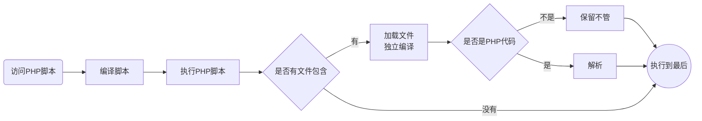

# 一、文件包含


> 目标：掌握文件包含的方式和作用，掌握文件包含的路径问题，能够熟练的运用文件包含实现系统性的代码复用

* 文件包含概念和应用
* 文件包含的路径问题


## 1、文件包含概念与作用


> 概念

**文件包含**：指将已有的代码以文件形式包含到某个指定的代码中，从而使用其中的代码或者数据

* 文件包含的本质是将多个文件变成一个整体
* 使用被包含文件内容
* 将当前文件内容给被包含文件使用


**文件包含作用**：数据或者结构的跨脚本使用

- 提升开发效率
- 提供代码复用
- 利于代码维护


> 流程图分析

1、使用被包含文件内容（被请求文件永远是主体）


2、将当前文件内容给被包含文件使用


> 小结

1、文件包含就是在一个被请求执行的PHP文件中引入另外一个文件

* 使用被包含文件里的代码（被包含文件右数据或者结构）
* 将当前文件内容给被包含文件使用（被包含文件是用来显示数据）

2、文件包含的作用

* 提升开发效率：小规模开发，大规模应用
* 提供代码复用：一次开发，多次运用
* 利于代码维护：一处更改，多处有效


## 2、文件包含实现


> 概念

PHP提供了四种文件包含的方式：都可以实现文件的包含

* include '文件名' （ include('文件名')）
* require '文件名'
* include_once '文件名'
* require_once '文件名'


> 步骤

1、明确当前文件要做的事情

* 数据或者结构提供者（结构或者配置文件）
* 数据显示者（HTML模板）
* 逻辑处理者（用户请求的逻辑处理代码）

2、给不同的文件提供不同的内容

3、在逻辑处理脚本上确定文件引入的目的

* 使用被包含文件的数据或者结构：提前包含
* 将当前处理结果进行显示：最后包含

4、应用

* 提前包含（向上包含）：直接在逻辑处理代码中应用被包含文件的数据或者结构
* 最后包含（向下包含）：在被包含文件中写代码使用逻辑处理脚本里的数据（被包含之前的所有数据）


> 示例

需求：在HTML中显示用户的个人信息

1、数据提供者：data.php中保存数据）

```php
#data.php
$info = [
    'name' 	=> '鸟哥',
    'age'  	=> 40,
    'gender'=> '男'	
];
```


2、数据显示者：list.html（模板）

```html
<html>
    <head>
        <title>显示个人信息</title>
    </head>
    <body>
        姓名：
        年龄：
        性别：
    </body>
</html>
```


3、逻辑处理者：controller.php

```php
#想要使用：data.php中的数据
include 'data.php';

#逻辑处理：判定等：可以使用data.php中的数据，因为是先包含

#想要显示数据：list.html，只能在list.hml使用上面的所有数据（不管是包含，还是当前脚本产生的）
include 'list.html';	
```

逻辑处理脚本（浏览器请求的脚本）自始至终都只做处理逻辑，不做其他事情（不提供数据、不进行显示）

既然要显示数据，就需要在数据显示者中利用PHP显示数据（list.html）

```html
<html>
    <head>
        <title>显示个人信息</title>
    </head>
    <body>
        <!--当前文件为HTML后缀，但是不独立运行会被PHP包含，所以可以嵌入PHP代码-->
        姓名：<?php echo $info['name'];?>
        年龄：<?php echo $info['age'];?>
        性别：<?php echo $info['gender'];?>
    </body>
</html>
```


> 小结

1、实现文件包含有四种方式

* include 和 include_once
* require 和 require_once

2、文件包含看对于被包含文件的需求分为

* 先包含：为了使用被包含文件中的数据或者结构
* 后包含：为了将当前所有数据给被包含文件使用
  * 被包含文件通常是为了显示数据
  * 可以不用管是什么格式，但是需要用PHP标签和语法来输出数据


## 3、文件包含区别


> 分析

1、include和require的区别

* include找不到文件报警告错误，不影响后续代码的继续执行
* require找不到文件报致命错误，后续代码终止执行

2、与_once的区别

* 没有_once：多次包含，系统会多次加载（如果有函数会报同名错误）
* 有_once：只包含一次，系统包含后会记录当前被包含文件是否包含过
  * 优势：安全
  * 缺点：效率低


> 示例

1、被包含文件：data.php

```php
function display(){
    echo __FUNCTION__;
}
```


2、include和require的区别

include包含不存在文件

```php
include 'd.php';		#报错
echo 'hello world';		#输出hello world
```


require包含不存在文件

```php
require 'd.php';		#报错
echo 'hello world';		#没有输出
```


3、include与include_once的区别（require和require_once一样）

include重复包含文件

```php
include 'data.php';		#输出display
include 'data.php';		#报错：display函数在前面已经定义过
```

include_once重复包含文件

```php
include_once 'data.php';#输出display
include_once 'data.php';#没有任何反应（忽略）
```


> 小结

1、include和require的区别是对于找不到文件的错误处理方式

* include给个警告，代码继续运行
* require给个错误，代码终止运行

2、include和include_once的区别

* include会重复包含，可能导致报错（结构重复）
* include_once只会包含一次（有开销）

3、在编程过程中我们应该尽可能保证代码的可运行性

* 尽可能使用require来包含结构和数据文件（容易排错）
* 尽可能使用include来包含外部可能存在的文件（重要性不高）
* 尽可能不用_once来进行文件包含
  * 效率低
  * 是否包含过应该开发者自己控制


## 4、文件包含原理


> 概念

**文件包含原理**：本质就是将被包含文件的代码包放到文件包含的代码处

* PHP代码：直接放到对应位置
* 非PHP代码：放到对应位置，但是PHP后续不会进行解析
* 文件包含的代码是在执行阶段进行解析
  * 编译阶段不会将被包含文件加载进来
  * 被包含文件运行时独立编译


> 流程图解析



因此：

* 在包含文件代码之前的所有代码只要没错都会执行
* 文件包含编译如果出错，只会影响到后续代码


> 小结

1、文件包含是在执行阶段才会读取文件并进行独立编译的

2、对于被包含文件

* PHP代码会解析
* 非PHP代码直接保留（当做HTML）


## 5、文件包含路径


> 概念

**文件包含路径**：指PHP在进行文件包含时能按照计算机上的路径找到目标文件

* 绝对路径
  * 本地绝对路径：磁盘目录（D:/server/apache/htdocs/index.php）
  * 网络绝对路径：url（http://www.baidu.com/resource/data.php）PHP默认不支持
* 相对路径
  * 当前目录： `./`  或者没有任何路径信息（默认当前文件所在路径）
  * 上级目录： `../` 当前目录上级目录


> 步骤

1、确定要包含的文件所在位置

2、使用路径进行明确包含


> 示例


---- dirA（D:/dirA）

-------- a.php

----- dirB（D:/dirB）

-------- b.php


1、相对路径包含：适合本身就在当前文件夹或者上级目录

```php
#b.php：所在d:/dirB	./表示dirB ../表示D:
include '../dirA/a.php';
```


2、绝对路径包含

```php
#b.php
include 'D:/dirA/a.php';
```


3、互联网绝对路径包含

```php
#b.php
include 'http://www.baidu.com/index.php';#报错：PHP关闭了url包含文件（不安全），开启配置即可
```


> 小结

1、文件不管是在本地磁盘函数互联网都是有路径的

2、包含文件通常需要指定路径

* 绝对路径
  * 磁盘路径：根目录买时
  * 互联网路径：url路径
* 相对路径
  * 当前目录： `./` 或者直接文件名（建议：直接文件名，不用`./`）
  * 上级目录： `../`

3、在进行文件包含时建议两种

* 绝对路径：效率低，但是准确度高（建议）
* 相对路径：效率高，相同目录下可以（直接使用文件名），有安全性问题（`./`和`../`导致）


## 6、嵌套包含路径问题


> 概念

嵌套包含路径问题：指的是在进行文件包含时使用了相对路径（./或者../），而且文件又有嵌套包含，导致./或者../无法正确识别路径

* 每个文件夹下都有./和../
* 嵌套包含会让系统无法正确原文件中./和../到底从哪开始
* 系统永远从当前工作目录的./和../开始寻找


> 步骤

1、A文件夹中有文件a.php和B文件夹

2、B文件夹中有b.php和C文件夹

3、C文件夹中有c.php

4、a.php包含b.php，同时b.php包含c.php

5、访问a.php


> 示例

1、A文件夹中a.php

```php
echo __DIR__;
include './B/b.php';
```


2、B文件夹中b.php

```php
echo __DIR__;
include './C/c.php';
```


3、C文件夹中c.php

```php
echo __DIR__;
```


注意：

1、独立访问b.php和c.php都没有问题

2、访问a.php，那么当前的工作路径就是A文件夹，b.php是在A目录工作，所以b.php的./目录属于A，因此找不到A文件夹下的C文件夹


> 小结

1、文件嵌套包含时./和../容易产生路径错乱问题

* 每个文件夹下都有./和../
* 脚本中的./和../是根据实际工作目录而定，而不是文件所在目录

2、为了避免出现嵌套路径问题，我们可以用以下解决方案

* 不使用相对路径./和../包含文件
* 使用绝对路径包含文件（推荐）
* 所有文件都放到一个文件夹下（几乎不可能，不利于维护）